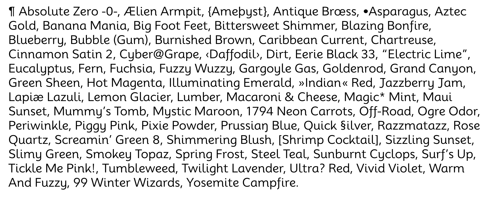

# Mooli

Mooli is a Sans Serif font designed for young readers. Mooli is derived from the Muli font family. Mooli has been designed to be used freely across the internet by web browsers on desktop computers, laptops and mobile devices.

## Author

Vernon practiced typeface design from 2007 to 2014. A lifelong artist, during this time he eagerly explored designing type for the cloud-based era. His work spans all genres, from lively script faces to workhorse text families and operating system UI. Vernon graduated with an MA in Typeface Design from the University of Reading and lives in California. His designs are mostly published as open source Google Fonts and his favorite projects include Oxygen Mono, Monda, and Bowlby One.

## Changelog

When you update your font (new version or new release), please report all notable changes here, with a date.
[Font Versioning](https://github.com/googlefonts/gf-docs/tree/main/Spec#font-versioning) is based on semver. 
Changelog example:

**2 August 2023. Version 1.000**
- Release - Set up the font according the GF specs. (Emma Marichal / font engineer)

## License

This Font Software is licensed under the SIL Open Font License, Version 1.1.
This license is available with a FAQ at
https://scripts.sil.org/OFL
